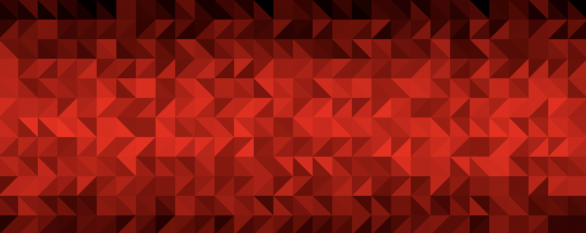

# circle_k



Replicate the Circle K generative art pattern in [p5js.org](https://editor.p5js.org/).

It's not the first solution, several students tried this:

- [William](https://github.com/IsNotAvaliable) - [Circle K](https://github.com/IsNotAvaliable/Circle_K_Pattern)
- [Dan](https://github.com/DanDC25) - [Circle K](https://github.com/DanDC25/Circle_K_Generative_Art)
- [Dongjae](https://github.com/dongdongthedingdong) - [Circle K](https://github.com/dongdongthedingdong/Circle-K-Project)
- [Khang](https://github.com/khangpham24) - [Circle K](https://github.com/khangpham24/CircleK_Art_Khang)

I should note that most copied the code from [this video of Mr. Weinberg](https://youtu.be/zwtpcwmTg7Q) and changed the colors.

## Code

``` js
let CELL_HEIGHT = 40  // width will be the same since its a square
let ROW_COUNT = 12    // we have 12 distinctable rows of alternating patterns
let COLUMN_COUNT = 20

function setup() {
  createCanvas(COLUMN_COUNT * CELL_HEIGHT, ROW_COUNT * CELL_HEIGHT);
  background(50);
  noStroke()
  for(var x = 0; x < COLUMN_COUNT; x++) {
    for(var y = 0; y < ROW_COUNT; y++) {
      shade = 150 * sin(PI * y / 12)
      fill(random(shade,shade + 105), 0, 0)
      x1 = x * CELL_HEIGHT
      y1 = y * CELL_HEIGHT
      square(x1, y1, CELL_HEIGHT)
      fill(random(shade,shade + 105), 0, 0)
      x2 = x1
      if(y % 2 == 0) {
        x2 += CELL_HEIGHT
      }
      triangle(x1, y1, x1 + CELL_HEIGHT, y1, x2, y1 + CELL_HEIGHT)
    }
  }
}

function draw() {

}
```

## Student work


